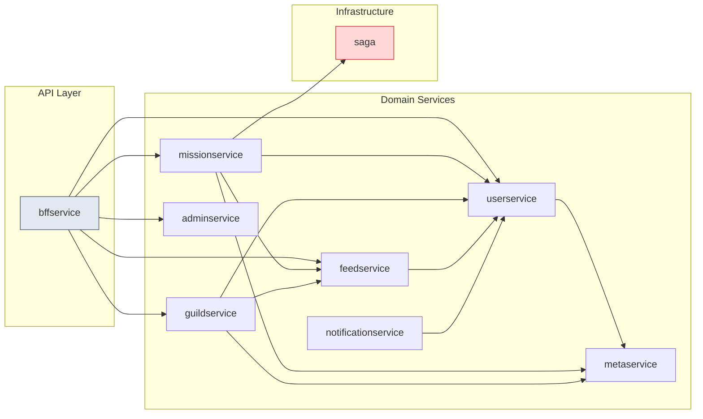

# Level Up Together MVP

함께 성장하는 미션 기반 커뮤니티 플랫폼의 백엔드 서비스입니다.

## 기술 스택

- **Framework**: Spring Boot 3.4.5, Spring Cloud 2024.0.0
- **Language**: Java 21 (JDK 25 빌드 호환)
- **Build**: Gradle 8.14.3
- **Database**: PostgreSQL (Production), H2 (Test)
- **Cache**: Redis (Lettuce)
- **Messaging**: Apache Kafka
- **API**: REST + GraphQL (Netflix DGS)
- **Documentation**: Spring REST Docs + OpenAPI 3.0
- **Query**: QueryDSL (타입 안전 쿼리)
- **Resilience**: Resilience4j (Circuit Breaker)

## 아키텍처

Multi-Service Monolith 구조로, 단일 배포 단위 내에서 서비스별로 독립된 데이터베이스를 사용합니다.
MSA 전환을 대비하여 각 서비스가 자체 데이터베이스와 트랜잭션 매니저를 가지고 있습니다.

### 아키텍처 다이어그램

```mermaid
graph TB
    subgraph Client["클라이언트"]
        APP["모바일 앱<br/>(React Native)"]
        WEB["웹 앱<br/>(Next.js)"]
        ADMIN["어드민<br/>(Next.js)"]
    end

    subgraph Gateway["API Gateway Layer"]
        SSL["HTTPS/SSL<br/>:8443"]
    end

    subgraph Application["Level Up Together MVP (Spring Boot 3.4.5)"]
        subgraph Services["Service Modules"]
            USER["userservice<br/>인증, 프로필<br/>친구, 퀘스트"]
            MISSION["missionservice<br/>미션 관리, Saga<br/>미션북"]
            GUILD["guildservice<br/>길드, 채팅<br/>게시판, 거점"]
            META["metaservice<br/>공통코드, 레벨설정<br/>캘린더"]
            FEED["feedservice<br/>활동 피드<br/>좋아요, 댓글"]
            NOTIF["notificationservice<br/>알림, 푸시<br/>알림 설정"]
            ADMIN_SVC["adminservice<br/>추천 콘텐츠<br/>홈 배너"]
            GAMIF["gamificationservice<br/>칭호, 업적, 경험치<br/>출석, 통계"]
            BFF["bffservice<br/>데이터 집계<br/>통합 검색"]
            NOTICE["noticeservice<br/>공지사항"]
            SUPPORT["supportservice<br/>고객지원"]
            LOGGER["loggerservice<br/>이벤트 로깅"]
        end

        subgraph Global["Global Infrastructure"]
            SAGA["Saga Pattern<br/>분산 트랜잭션"]
            SECURITY["JWT/OAuth2<br/>보안 필터"]
            CACHE["Redis Cache<br/>메타데이터 캐싱"]
        end
    end

    subgraph Databases["PostgreSQL Databases"]
        USER_DB[("user_db<br/>사용자, 인증<br/>친구, 퀘스트")]
        MISSION_DB[("mission_db<br/>미션, 실행<br/>카테고리")]
        GUILD_DB[("guild_db<br/>길드, 멤버<br/>채팅, 게시판")]
        META_DB[("meta_db<br/>공통코드<br/>레벨설정")]
        FEED_DB[("feed_db<br/>피드, 댓글<br/>좋아요")]
        NOTIF_DB[("notification_db<br/>알림<br/>알림설정")]
        ADMIN_DB[("admin_db<br/>추천콘텐츠<br/>배너")]
        GAMIF_DB[("gamification_db<br/>칭호, 업적<br/>경험치, 출석")]
        SAGA_DB[("saga_db<br/>Saga 상태<br/>스텝 로그")]
    end

    subgraph External["External Services"]
        REDIS[("Redis<br/>캐시")]
        KAFKA["Kafka<br/>메시징"]
        MONGO[("MongoDB<br/>로그")]
    end

    APP --> SSL
    WEB --> SSL
    ADMIN --> SSL

    SSL --> BFF
    SSL --> USER
    SSL --> MISSION
    SSL --> GUILD
    SSL --> FEED
    SSL --> NOTIF
    SSL --> NOTICE

    USER --> USER_DB
    MISSION --> MISSION_DB
    GUILD --> GUILD_DB
    META --> META_DB
    FEED --> FEED_DB
    NOTIF --> NOTIF_DB
    ADMIN_SVC --> ADMIN_DB
    GAMIF --> GAMIF_DB
    SAGA --> SAGA_DB

    LOGGER --> MONGO
    LOGGER --> KAFKA
    CACHE --> REDIS

    classDef service fill:#4a90d9,stroke:#2c5282,color:#fff
    classDef db fill:#48bb78,stroke:#276749,color:#fff
    classDef external fill:#ed8936,stroke:#c05621,color:#fff
    classDef client fill:#9f7aea,stroke:#6b46c1,color:#fff

    class USER,MISSION,GUILD,META,FEED,NOTIF,ADMIN_SVC,GAMIF,BFF,NOTICE,SUPPORT,LOGGER service
    class USER_DB,MISSION_DB,GUILD_DB,META_DB,FEED_DB,NOTIF_DB,ADMIN_DB,GAMIF_DB,SAGA_DB db
    class REDIS,KAFKA,MONGO external
    class APP,WEB,ADMIN client
```



### 서비스 간 의존성



### 디렉토리 구조

```
src/main/java/io/pinkspider/
├── leveluptogethermvp/
│   ├── userservice/          # 인증, OAuth2, JWT, 사용자 관리, 경험치/레벨
│   ├── missionservice/       # 미션 정의, 진행 관리, Saga 오케스트레이션
│   ├── guildservice/         # 길드 생성, 멤버 관리, 길드 경험치
│   ├── metaservice/          # 공통코드, 메타데이터, Redis 캐싱
│   ├── feedservice/          # 활동 피드, 좋아요, 댓글
│   ├── notificationservice/  # 알림 관리, 푸시 알림
│   ├── adminservice/         # 추천 콘텐츠, 홈 배너 관리
│   ├── noticeservice/        # 공지사항 관리
│   ├── supportservice/       # 고객지원
│   ├── bffservice/           # Backend-for-Frontend 집계 레이어
│   ├── loggerservice/        # 이벤트 로깅, MongoDB, Kafka
│   └── profanity/            # 비속어 필터링
└── global/
    ├── config/
    │   └── datasource/       # 멀티 데이터소스 설정 (8개 DB)
    ├── saga/                 # Saga 패턴 인프라 (MSA 전환 대비)
    ├── exception/            # 공통 예외 처리
    ├── security/             # JWT, OAuth2 보안 필터
    ├── translation/          # 다국어 번역 지원
    └── validation/           # 입력 검증
```

## 데이터베이스 구조

서비스별 독립된 데이터베이스를 사용하며, 각 데이터소스는 별도의 Transaction Manager를 가집니다.

### 데이터베이스 ERD

```mermaid
erDiagram
    user_db {
        users PK
        user_term_agreement FK
        term
        term_version
        quest
        quest_progress
        friend
        friend_request
        user_token
    }

    mission_db {
        mission PK
        mission_category
        mission_participant FK
        mission_execution FK
        mission_state_history
    }

    guild_db {
        guild PK
        guild_member FK
        guild_post
        guild_post_comment
        guild_chat_message
        guild_join_request
        guild_experience_history
        guild_level_config
        guild_headquarters_config
    }

    feed_db {
        activity_feed PK
        feed_comment FK
        feed_like FK
    }

    notification_db {
        notification PK
        notification_preference FK
    }

    admin_db {
        home_banner PK
        featured_feed
        featured_guild
        featured_player
    }

    meta_db {
        common_code PK
        calendar_holiday
        level_config
        content_translation
        profanity_word
    }

    gamification_db {
        title PK
        achievement PK
        user_title FK
        user_achievement FK
        user_stats
        user_experience
        experience_history
        attendance_record
        attendance_reward_config
    }

    saga_db {
        saga_instance PK
        saga_step_log FK
    }

    user_db ||--o{ mission_db : "creator_id"
    user_db ||--o{ guild_db : "master_id/member"
    user_db ||--o{ feed_db : "user_id"
    user_db ||--o{ notification_db : "user_id"
    user_db ||--o{ gamification_db : "user_id"
    mission_db ||--o{ feed_db : "mission_id"
    guild_db ||--o{ feed_db : "guild_id"
```

### Transaction Manager 매핑

| 데이터베이스 | 서비스 | Transaction Manager | 주요 테이블 |
|-------------|--------|---------------------|------------|
| `user_db` | userservice | `userTransactionManager` (Primary) | users, quest, friend |
| `mission_db` | missionservice | `missionTransactionManager` | mission, mission_execution, mission_participant |
| `guild_db` | guildservice | `guildTransactionManager` | guild, guild_member, guild_post, guild_chat |
| `meta_db` | metaservice | `metaTransactionManager` | common_code, level_config, calendar_holiday |
| `feed_db` | feedservice | `feedTransactionManager` | activity_feed, feed_comment, feed_like |
| `notification_db` | notificationservice | `notificationTransactionManager` | notification, notification_preference |
| `admin_db` | adminservice | `adminTransactionManager` | home_banner, featured_feed/guild/player |
| `gamification_db` | gamificationservice | `gamificationTransactionManager` | title, achievement, user_title, user_achievement, user_stats, user_experience, experience_history, attendance_record, attendance_reward_config |
| `saga_db` | saga (global) | `sagaTransactionManager` | saga_instance, saga_step_log |

> **주의**: `@Transactional` 사용 시 반드시 해당 서비스의 트랜잭션 매니저를 명시해야 합니다.
> ```java
> @Transactional(transactionManager = "feedTransactionManager")
> public void createFeed(...) { ... }
> ```

## 시작하기

### 요구사항

- JDK 21 (또는 JDK 25 with toolchain)
- Gradle 8.14+
- PostgreSQL / Redis / Kafka (또는 test 프로필 사용)

### 빌드 및 실행

```bash
# 빌드
./gradlew clean build

# 테스트 실행
./gradlew test

# 단일 테스트 클래스 실행
./gradlew test --tests "io.pinkspider.leveluptogethermvp.userservice.oauth.api.Oauth2ControllerTest"

# 단일 테스트 메서드 실행
./gradlew test --tests "*.Oauth2ControllerTest.getOauth2LoginUri"

# 애플리케이션 실행 (기본 포트: 8443)
./gradlew bootRun

# 테스트 프로필로 실행 (포트: 18080, H2 인메모리 DB)
./gradlew bootRun --args='--spring.profiles.active=test'
```

### API 문서 생성

```bash
./gradlew openapi3 && ./gradlew sortOpenApiJson && ./gradlew copySortedOpenApiJson
```

### GraphQL 클래스 생성

```bash
./gradlew generateJava
```

## 주요 기능

### 사용자 (User Service)
- OAuth2 소셜 로그인 (Google, Kakao, Apple)
- JWT 기반 토큰 인증 (멀티 디바이스 지원)
- 약관 동의 관리
- 경험치/레벨 시스템
- 친구 관리 (친구 요청/수락/거절)
- 업적/칭호 시스템 (LEFT+RIGHT 조합 방식)
- 출석 체크 (연속 출석 보너스)
- 퀘스트 (일일/주간)
- 마이페이지 (프로필, 통계)

### 미션 (Mission Service)
- 미션 생성 및 관리 (일일/주간/월간 인터벌)
- 미션 카테고리 (시스템 카테고리 + 사용자 정의)
- 미션 참가자 진행 상태 추적
- 미션 실행 스케줄 자동 생성
- 미션 완료 시 경험치 지급
- 미션북 (시스템 미션 라이브러리)
- Saga 패턴 기반 분산 트랜잭션 관리

### 길드 (Guild Service)
- 길드 생성 및 관리
- 멤버 가입/탈퇴/추방 관리
- 길드 경험치/레벨 시스템
- 길드 게시판 (공지사항, 일반 게시글)
- 길드 채팅
- 길드 거점 시스템 (지도 기반)
- 길드원 칭호 색상 표시

### 활동 피드 (Feed Service)
- 활동 피드 생성 및 조회
- 피드 좋아요/댓글
- 피드 공개 범위 설정 (전체/친구/길드/비공개)
- 미션 완료 시 자동 피드 생성
- 피드 검색 기능

### 알림 (Notification Service)
- 인앱 알림 관리
- 푸시 알림 (FCM)
- 알림 설정 (타입별 on/off)
- 알림 읽음 처리

### 관리 (Admin Service)
- 홈 배너 관리
- 추천 플레이어/길드/피드 관리
- Featured 콘텐츠 관리

### 메타데이터 (Meta Service)
- 공통 코드 관리 (Redis 캐싱)
- 캘린더 휴일 정보
- 레벨 설정 관리
- 비속어 필터링
- 다국어 번역 지원

### BFF (Backend-for-Frontend)
- 홈 화면 데이터 집계
- 통합 검색 (피드, 미션, 사용자, 길드)
- 다중 서비스 데이터 조합

## API 응답 형식

모든 REST 엔드포인트는 `ApiResult<T>` 래퍼를 사용합니다:

```json
{
  "code": "0000",
  "message": "success",
  "value": { ... }
}
```

## 환경 설정

| 프로필 | 설명 |
|--------|------|
| `test` | H2 인메모리 DB, 테스트용 Kafka |
| `local` | Config Server 연동 |
| `dev` | 개발 서버 환경 |
| `prod` | 운영 서버 환경 |

## 모니터링

- **Actuator**: `/showmethemoney`
- **Tracing**: Zipkin 연동
- **Metrics**: Micrometer + Prometheus

## CI/CD

- `main` 브랜치 → Production 배포 (테스트 포함)
- `develop` 브랜치 → Dev 배포 (테스트 스킵)
- Swagger 문서 자동 업데이트
- Slack 알림 연동

## 관련 프로젝트

| 프로젝트 | 설명 |
|---------|------|
| `level-up-together-frontend` | 사용자 앱 프론트엔드 (Next.js) |
| `level-up-together-mvp-admin` | 어드민 백엔드 (Spring Boot) |
| `level-up-together-admin-frontend` | 어드민 프론트엔드 (Next.js) |
| `level-up-together-sql` | SQL 스크립트 (DDL/DML) |
| `config-repository` | Spring Cloud Config 저장소 |

## 개발 서버
- https://dev.level-up-together.com:3000