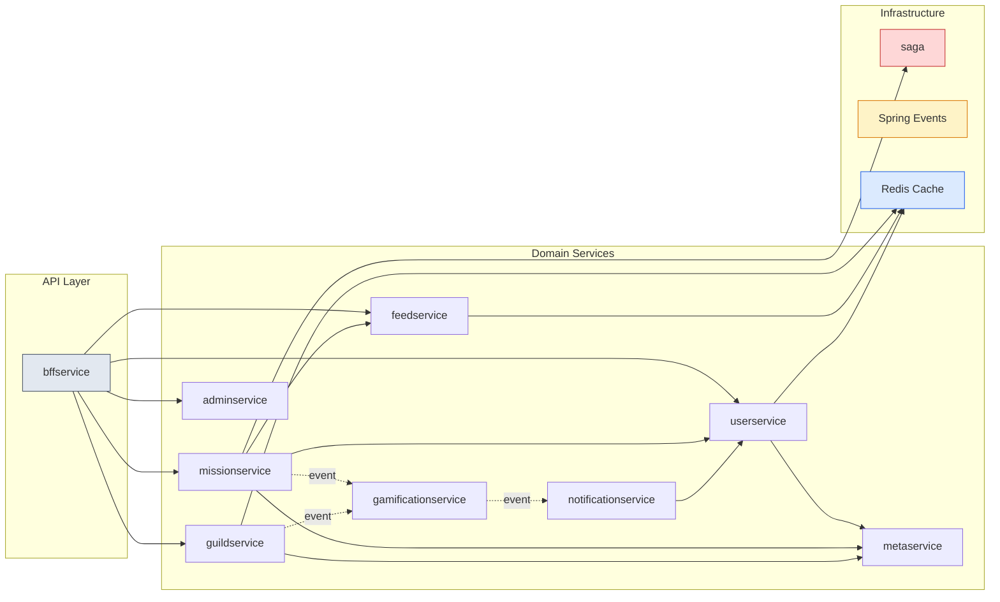

# Level Up Together MVP

함께 성장하는 미션 기반 커뮤니티 플랫폼의 백엔드 서비스입니다.

## 기술 스택

- **Framework**: Spring Boot 3.4.5, Spring Cloud 2024.0.0
- **Language**: Java 21 (JDK 25 빌드 호환)
- **Build**: Gradle 8.14.3
- **Database**: PostgreSQL (Production), H2 (Test)
- **Cache**: Redis (Lettuce)
- **Messaging**: Apache Kafka
- **API**: REST + GraphQL (Netflix DGS)
- **Documentation**: Spring REST Docs + OpenAPI 3.0
- **Query**: QueryDSL (타입 안전 쿼리)
- **Resilience**: Resilience4j (Circuit Breaker)

## 아키텍처

Multi-Service Monolith 구조로, 단일 배포 단위 내에서 서비스별로 독립된 데이터베이스를 사용합니다.
MSA 전환을 대비하여 각 서비스가 자체 데이터베이스와 트랜잭션 매니저를 가지고 있습니다.

**주요 아키텍처 특징:**
- **Event-Driven**: Spring Events를 활용한 서비스 간 느슨한 결합
- **Redis Caching**: 자주 조회되는 데이터의 캐싱으로 성능 최적화
- **Saga Pattern**: 분산 트랜잭션 관리 (MSA 전환 대비)

### 아키텍처 다이어그램


### 서비스 간 의존성



### Event-Driven 아키텍처

서비스 간 직접 의존성을 줄이고 느슨한 결합을 위해 Spring Events를 활용합니다.

```mermaid
graph LR
    subgraph "Event Publishers"
        GUILD_SVC["GuildService"]
        MISSION_SVC["MissionService"]
        FRIEND_SVC["FriendService"]
    end

    subgraph "Events"
        GJE["GuildJoinedEvent"]
        GME["GuildMasterAssignedEvent"]
        FRE["FriendRequestEvent"]
        MCE["MissionCompletedEvent"]
    end

    subgraph "Event Listeners"
        ACH_LISTENER["AchievementEventListener"]
        NOTIF_LISTENER["NotificationEventListener"]
    end

    GUILD_SVC -->|publish| GJE
    GUILD_SVC -->|publish| GME
    FRIEND_SVC -->|publish| FRE
    MISSION_SVC -->|publish| MCE

    GJE -->|@TransactionalEventListener| ACH_LISTENER
    GME -->|@TransactionalEventListener| ACH_LISTENER
    FRE -->|@TransactionalEventListener| NOTIF_LISTENER
    MCE -->|@TransactionalEventListener| NOTIF_LISTENER

    style GJE fill:#fef3c7,stroke:#d97706
    style GME fill:#fef3c7,stroke:#d97706
    style FRE fill:#fef3c7,stroke:#d97706
    style MCE fill:#fef3c7,stroke:#d97706
```

**주요 이벤트:**
| 이벤트 | 발행 서비스 | 리스너 | 설명 |
|--------|------------|--------|------|
| `GuildJoinedEvent` | GuildService | AchievementEventListener | 길드 가입 시 업적 확인 |
| `GuildMasterAssignedEvent` | GuildService | AchievementEventListener | 길드장 지정 시 업적 확인 |
| `FriendRequestAcceptedEvent` | FriendService | NotificationEventListener | 친구 수락 알림 |
| `MissionCompletedEvent` | MissionService | NotificationEventListener | 미션 완료 알림 |

### 캐싱 전략

Redis를 활용한 캐싱으로 서비스 간 호출을 최소화하고 성능을 최적화합니다.

| 캐시 서비스 | 캐시 키 | TTL | 설명 |
|------------|--------|-----|------|
| `UserProfileCacheService` | `userProfile:{userId}` | 5분 | 유저 프로필 정보 (nickname, level, title) |
| `FriendCacheService` | `friendIds:{userId}` | 10분 | 친구 ID 목록 |
| `TitleService` | `userTitleInfo:{userId}` | 5분 | 장착된 칭호 정보 |
| `MissionCategoryService` | `missionCategories:{categoryId}` | 1시간 | 미션 카테고리 정보 |

**캐시 무효화:**
- 데이터 수정/삭제 시 `@CacheEvict` 자동 무효화
- 적절한 TTL로 캐시-DB 불일치 최소화

### 디렉토리 구조

```
src/main/java/io/pinkspider/
├── leveluptogethermvp/
│   ├── userservice/          # 인증, OAuth2, JWT, 사용자 관리
│   ├── missionservice/       # 미션 정의, 진행 관리, Saga 오케스트레이션
│   ├── guildservice/         # 길드 생성, 멤버 관리, 길드 경험치
│   ├── metaservice/          # 공통코드, 메타데이터, Redis 캐싱
│   ├── feedservice/          # 활동 피드, 좋아요, 댓글
│   ├── notificationservice/  # 알림 관리, 푸시 알림
│   ├── adminservice/         # 추천 콘텐츠, 홈 배너 관리
│   ├── gamificationservice/  # 칭호, 업적, 경험치, 출석
│   ├── noticeservice/        # 공지사항 관리
│   ├── supportservice/       # 고객지원
│   ├── bffservice/           # Backend-for-Frontend 집계 레이어
│   ├── loggerservice/        # 이벤트 로깅, MongoDB, Kafka
│   └── profanity/            # 비속어 필터링
└── global/
    ├── config/
    │   └── datasource/       # 멀티 데이터소스 설정 (9개 DB)
    ├── event/                # Spring Events (서비스 간 이벤트 통신)
    │   ├── listener/         # @TransactionalEventListener 핸들러
    │   └── *.java            # 이벤트 record 클래스
    ├── saga/                 # Saga 패턴 인프라 (MSA 전환 대비)
    ├── exception/            # 공통 예외 처리
    ├── security/             # JWT, OAuth2 보안 필터
    ├── translation/          # 다국어 번역 지원
    └── validation/           # 입력 검증
```

## 데이터베이스 구조

서비스별 독립된 데이터베이스를 사용하며, 각 데이터소스는 별도의 Transaction Manager를 가집니다.

### 데이터베이스 ERD

```mermaid
erDiagram
    user_db {
        users PK
        user_term_agreement FK
        term
        term_version
        quest
        quest_progress
        friend
        friend_request
        user_token
    }

    mission_db {
        mission PK
        mission_category
        mission_participant FK
        mission_execution FK
        mission_state_history
        daily_mission_instance FK
    }

    guild_db {
        guild PK
        guild_member FK
        guild_post
        guild_post_comment
        guild_chat_message
        guild_join_request
        guild_experience_history
        guild_level_config
        guild_headquarters_config
    }

    feed_db {
        activity_feed PK
        feed_comment FK
        feed_like FK
    }

    notification_db {
        notification PK
        notification_preference FK
    }

    admin_db {
        home_banner PK
        featured_feed
        featured_guild
        featured_player
    }

    meta_db {
        common_code PK
        calendar_holiday
        level_config
        content_translation
        profanity_word
    }

    gamification_db {
        title PK
        achievement PK
        achievement_category
        check_logic_type
        user_title FK
        user_achievement FK
        user_stats
        user_experience
        experience_history
        attendance_record
        attendance_reward_config
        event
        season
        season_rank_reward
    }

    saga_db {
        saga_instance PK
        saga_step_log FK
    }

    user_db ||--o{ mission_db : "creator_id"
    user_db ||--o{ guild_db : "master_id/member"
    user_db ||--o{ feed_db : "user_id"
    user_db ||--o{ notification_db : "user_id"
    user_db ||--o{ gamification_db : "user_id"
    mission_db ||--o{ feed_db : "mission_id"
    guild_db ||--o{ feed_db : "guild_id"
```

### Transaction Manager 매핑

| 데이터베이스 | 서비스 | Transaction Manager | 주요 테이블 |
|-------------|--------|---------------------|------------|
| `user_db` | userservice | `userTransactionManager` (Primary) | users, quest, friend |
| `mission_db` | missionservice | `missionTransactionManager` | mission, mission_execution, mission_participant, daily_mission_instance |
| `guild_db` | guildservice | `guildTransactionManager` | guild, guild_member, guild_post, guild_chat |
| `meta_db` | metaservice | `metaTransactionManager` | common_code, level_config, calendar_holiday |
| `feed_db` | feedservice | `feedTransactionManager` | activity_feed, feed_comment, feed_like |
| `notification_db` | notificationservice | `notificationTransactionManager` | notification, notification_preference |
| `admin_db` | adminservice | `adminTransactionManager` | home_banner, featured_feed/guild/player |
| `gamification_db` | gamificationservice | `gamificationTransactionManager` | title, achievement, achievement_category, check_logic_type, user_title, user_achievement, user_stats, user_experience, experience_history, attendance_record, attendance_reward_config, event, season |
| `saga_db` | saga (global) | `sagaTransactionManager` | saga_instance, saga_step_log |

> **주의**: `@Transactional` 사용 시 반드시 해당 서비스의 트랜잭션 매니저를 명시해야 합니다.
> ```java
> @Transactional(transactionManager = "feedTransactionManager")
> public void createFeed(...) { ... }
> ```

## 시작하기

### 요구사항

- JDK 21 (또는 JDK 25 with toolchain)
- Gradle 8.14+
- PostgreSQL / Redis / Kafka (또는 test 프로필 사용)

### 빌드 및 실행

```bash
# 빌드
./gradlew clean build

# 테스트 실행
./gradlew test

# 단일 테스트 클래스 실행
./gradlew test --tests "io.pinkspider.leveluptogethermvp.userservice.oauth.api.Oauth2ControllerTest"

# 단일 테스트 메서드 실행
./gradlew test --tests "*.Oauth2ControllerTest.getOauth2LoginUri"

# 애플리케이션 실행 (기본 포트: 8443)
./gradlew bootRun

# 테스트 프로필로 실행 (포트: 18080, H2 인메모리 DB)
./gradlew bootRun --args='--spring.profiles.active=test'
```

### API 문서 생성

```bash
./gradlew openapi3 && ./gradlew sortOpenApiJson && ./gradlew copySortedOpenApiJson
```

### GraphQL 클래스 생성

```bash
./gradlew generateJava
```

### 테스트 커버리지

JaCoCo를 사용하며 최소 **70%** 커버리지를 요구합니다.

```bash
# 테스트 실행 후 커버리지 리포트 생성
./gradlew test jacocoTestReport

# 리포트 위치: build/reports/jacoco/html/index.html
```

## 주요 기능

### 사용자 (User Service)
- OAuth2 소셜 로그인 (Google, Kakao, Apple)
- JWT 기반 토큰 인증 (멀티 디바이스 지원)
- 약관 동의 관리
- 친구 관리 (친구 요청/수락/거절)
- 퀘스트 (일일/주간)
- 마이페이지 (프로필, 통계)
- `FriendCacheService`: 친구 목록 캐싱

### 게이미피케이션 (Gamification Service)
- 경험치/레벨 시스템
- 업적/칭호 시스템 (LEFT+RIGHT 조합 방식)
  - Strategy 패턴 기반 동적 업적 체크 (`AchievementCheckStrategy`)
  - 미션 카테고리별 완료 횟수 업적 지원 (`MissionCategoryCompletionStrategy`)
  - code 필드 기반 업적 식별 (DB 관리)
- 출석 체크 (연속 출석 보너스)
- 사용자 통계 관리
- 이벤트 관리 (기간별 이벤트, 활성/비활성 관리)
- 시즌 관리 (시즌별 랭킹, 보상)
- `UserProfileCacheService`: 유저 프로필 캐싱 (nickname, level, title)

### 미션 (Mission Service)
- 미션 생성 및 관리 (일일/주간/월간 인터벌)
- 미션 카테고리 (시스템 카테고리 + 사용자 정의)
- 미션 참가자 진행 상태 추적
- 미션 실행 스케줄 자동 생성
- 미션 완료 시 경험치 지급
- 미션북 (시스템 미션 라이브러리)
- Saga 패턴 기반 분산 트랜잭션 관리
- **고정 미션 (Pinned Mission)**: Template-Instance 패턴
  - `DailyMissionInstance`: 매일 자동 생성되는 일일 인스턴스
  - 미션 정보 스냅샷 저장 (미션 변경 시 과거 기록 보존)
  - 배치 스케줄러: 매일 00:05 자동 생성 (`DailyMissionInstanceScheduler`)

### 길드 (Guild Service)
- 길드 생성 및 관리
- 멤버 가입/탈퇴/추방 관리
- 길드 경험치/레벨 시스템
- 길드 게시판 (공지사항, 일반 게시글)
- 길드 채팅
- 길드 거점 시스템 (지도 기반)
- 길드원 칭호 색상 표시
- Event-Driven: 가입/길드장 지정 시 업적 이벤트 발행

### 활동 피드 (Feed Service)
- 활동 피드 생성 및 조회
- 피드 좋아요/댓글 (댓글 작성자 레벨 표시)
- 피드 공개 범위 설정 (전체/친구/길드/비공개)
- 미션 완료 시 자동 피드 생성
- 피드 삭제 (본인 피드만)
- 피드 검색 기능
- `UserProfileCacheService` 활용한 유저 정보 캐싱

### 알림 (Notification Service)
- 인앱 알림 관리
- 푸시 알림 (FCM)
- 알림 설정 (타입별 on/off)
- 알림 읽음 처리
- Event-Driven: `@TransactionalEventListener`로 알림 이벤트 수신

### 관리 (Admin Service)
- 홈 배너 관리
- 추천 플레이어/길드/피드 관리
- Featured 콘텐츠 관리

### 메타데이터 (Meta Service)
- 공통 코드 관리 (Redis 캐싱)
- 캘린더 휴일 정보
- 레벨 설정 관리
- 비속어 필터링
- 다국어 번역 지원

### BFF (Backend-for-Frontend)
- 홈 화면 데이터 집계 (피드, 랭킹, 길드, 공지사항, 이벤트)
- 통합 검색 (피드, 미션, 사용자, 길드)
- 다중 서비스 데이터 조합

## HTTP API 테스트

`http/` 폴더에 IntelliJ HTTP Client 형식의 API 테스트 파일이 있습니다:

```
http/
├── http-client.env.json    # 환경 설정 (dev, local, test)
├── oauth-jwt.http          # OAuth2 로그인, JWT 토큰 관리
├── mission.http            # 미션 CRUD, 참가자, 실행 추적
├── guild.http              # 길드 관리, 채팅, 게시판, 거점
├── activity-feed.http      # 피드, 좋아요, 댓글
├── friend.http             # 친구 요청/수락/거절
├── mypage.http             # 프로필, 닉네임, 칭호
├── achievement.http        # 업적, 칭호, 레벨 랭킹
├── attendance.http         # 출석 체크
├── notification.http       # 알림 관리
├── device-token.http       # FCM 토큰 관리
├── event.http              # 이벤트 API
├── bff.http                # BFF 홈, 통합 검색
├── home.http               # 홈 배너, 추천 콘텐츠
├── meta.http               # 메타데이터, 공통 코드
├── user-terms.http         # 약관 동의
└── user-experience.http    # 경험치, 레벨
```

**환경 변수:**
- `{{baseUrl}}`: API 서버 주소
- `{{accessToken}}`: JWT 액세스 토큰
- `{{refreshToken}}`: JWT 리프레시 토큰

## API 응답 형식

모든 REST 엔드포인트는 `ApiResult<T>` 래퍼를 사용합니다:

```json
{
  "code": "000000",
  "message": "success",
  "value": { ... }
}
```

**API 필드 네이밍**: 프론트엔드와의 통신에서 모든 필드는 `snake_case`를 사용합니다.

### 에러 코드 체계

6자리 코드: `[서비스 2자리][카테고리 2자리][일련번호 2자리]`

| 서비스 | 코드 접두사 |
|--------|------------|
| global | 00 |
| bff-service | 01 |
| api-gateway | 02 |
| user-service | 03 |
| guild-service | 04 |
| mission-service | 05 |
| app-push-service | 06 |
| payment-service | 07 |
| meta-service | 08 |
| logger-service | 09 |
| stats-service | 10 |
| batch-service | 11 |

## 환경 설정

| 프로필 | 설명 |
|--------|------|
| `test` | H2 인메모리 DB, 테스트용 Kafka |
| `local` | Config Server 연동 |
| `dev` | 개발 서버 환경 |
| `prod` | 운영 서버 환경 |

## 모니터링

- **Actuator**: `/showmethemoney`
- **Tracing**: Zipkin 연동
- **Metrics**: Micrometer + Prometheus

## CI/CD

- `main` 브랜치 → Production 배포 (테스트 포함)
- `develop` 브랜치 → Dev 배포 (테스트 스킵)
- Swagger 문서 자동 업데이트
- Slack 알림 연동

## 관련 프로젝트

| 프로젝트 | 설명 |
|---------|------|
| `level-up-together-frontend` | 사용자 앱 프론트엔드 (Next.js) |
| `LevelUpTogetherReactNative` | 모바일 하이브리드 앱 (React Native) |
| `level-up-together-mvp-admin` | 어드민 백엔드 (Spring Boot) |
| `level-up-together-admin-frontend` | 어드민 프론트엔드 (Next.js) |
| `level-up-together-sql` | SQL 스크립트 (DDL/DML) |
| `config-repository` | Spring Cloud Config 저장소 |

## 문제 해결

### QueryDSL 빌드 오류

`Attempt to recreate a file for type Q*` 오류 발생 시:
```bash
./gradlew clean compileJava
```

### 트랜잭션 매니저 미지정 오류

데이터가 저장되지 않거나 조회되지 않는 경우, `@Transactional`에 올바른 트랜잭션 매니저가 지정되어 있는지 확인하세요.

```java
// 올바른 예시
@Transactional(transactionManager = "guildTransactionManager")
public void updateGuild(...) { ... }

// 잘못된 예시 - 기본값(userTransactionManager)이 사용됨
@Transactional
public void updateGuild(...) { ... }
```

### Integration Tests 실패

SSH 터널이나 외부 서비스 연결이 필요한 테스트는 로컬에서 실패할 수 있습니다. `@ActiveProfiles("test")` 확인이 필요합니다.

## 최근 업데이트

### 2026-01 고정 미션 Template-Instance 패턴
- `DailyMissionInstance` 엔티티 추가 (고정 미션 일일 인스턴스)
- `DailyMissionInstanceService` 서비스 추가
- `DailyMissionInstanceScheduler` 배치 스케줄러 추가 (매일 00:05 자동 생성)
- `MissionExecutionService`에서 고정 미션 분기 처리 (API 하위 호환성 유지)
- `CreateFeedFromMissionStep`에서 feedId 저장 버그 수정

### 2026-01 칭호 시스템 개선
- LEFT/RIGHT 칭호 개별 희귀도 표시 기능 추가
  - `TodayPlayerResponse`: leftTitle, leftTitleRarity, rightTitle, rightTitleRarity 필드 추가
  - `SeasonMvpPlayerResponse`: 동일 필드 추가
- 프론트엔드에서 각 칭호를 개별 색상으로 표시 가능

### 2026-01 업적 시스템 리팩토링
- Strategy 패턴 기반 동적 업적 체크 시스템 구현 (`AchievementCheckStrategy`)
- 미션 카테고리별 완료 횟수 업적 체크 기능 추가 (`MissionCategoryCompletionStrategy`)
- code 필드 기반 업적 식별로 전환 (DB 관리)
- 이벤트 관리 기능 추가 (gamificationservice)
- BFF 홈 화면에 이벤트 목록 추가

### 2026-01 시즌 랭킹 기능
- SeasonRankReward에 titleRarity 필드 추가
- Redis 캐시 직렬화 오류 수정
- 시즌 랭킹 기능 확장

### 2025-01 Event-Driven 전환
- Spring Events 기반 서비스 간 통신 구현
- Redis 캐싱 서비스 추가 (UserProfileCacheService, FriendCacheService)
- GuildService → AchievementService 직접 의존성 제거
- `@TransactionalEventListener(phase = AFTER_COMMIT)` 패턴 적용

### 2025-01 피드 기능 개선
- 댓글 작성자 레벨 표시 기능 추가 (`user_level` 필드)
- 피드 삭제 기능 (본인 피드만)
- 피드 작성자 프로필 캐싱 적용

## 개발 서버

- https://dev.level-up-together.com:3000