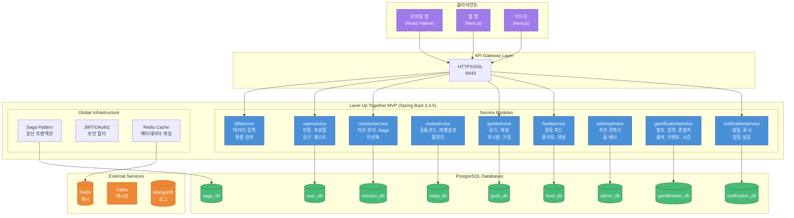

# Level Up Together MVP

함께 성장하는 미션 기반 커뮤니티 플랫폼의 백엔드 서비스입니다.

## 기술 스택

| 카테고리 | 기술 |
|---------|------|
| **Framework** | Spring Boot 3.4.5, Spring Cloud 2024.0.0 |
| **Language** | Java 21 (JDK 25 빌드 호환) |
| **Build** | Gradle 8.14.3 |
| **Database** | PostgreSQL (Production), H2 (Test) |
| **Cache** | Redis (Lettuce) |
| **Messaging** | Apache Kafka |
| **API** | REST + GraphQL (Netflix DGS) |
| **Documentation** | Spring REST Docs + OpenAPI 3.0 |
| **Query** | QueryDSL (타입 안전 쿼리) |
| **Resilience** | Resilience4j (Circuit Breaker) |

## 아키텍처

Multi-Service Monolith 구조로, 단일 배포 단위 내에서 서비스별로 독립된 데이터베이스를 사용합니다.
MSA 전환을 대비하여 각 서비스가 자체 데이터베이스와 트랜잭션 매니저를 가지고 있습니다.

**주요 아키텍처 특징:**
- **Event-Driven**: Spring Events를 활용한 서비스 간 느슨한 결합
- **Redis Caching**: 자주 조회되는 데이터의 캐싱으로 성능 최적화
- **Saga Pattern**: 분산 트랜잭션 관리 (MSA 전환 대비)

### 시스템 아키텍처



### 서비스 간 의존성


### Event-Driven 아키텍처

서비스 간 직접 의존성을 줄이고 느슨한 결합을 위해 Spring Events를 활용합니다.

```mermaid
graph LR
    subgraph "Event Publishers"
        GUILD_SVC["GuildService"]
        MISSION_SVC["MissionService"]
        FRIEND_SVC["FriendService"]
    end

    subgraph "Events"
        GJE["GuildJoinedEvent"]
        GME["GuildMasterAssignedEvent"]
        FRE["FriendRequestEvent"]
        MCE["MissionCompletedEvent"]
    end

    subgraph "Event Listeners"
        ACH_LISTENER["AchievementEventListener"]
        NOTIF_LISTENER["NotificationEventListener"]
    end

    GUILD_SVC -->|publish| GJE
    GUILD_SVC -->|publish| GME
    FRIEND_SVC -->|publish| FRE
    MISSION_SVC -->|publish| MCE

    GJE -->|@TransactionalEventListener| ACH_LISTENER
    GME -->|@TransactionalEventListener| ACH_LISTENER
    FRE -->|@TransactionalEventListener| NOTIF_LISTENER
    MCE -->|@TransactionalEventListener| NOTIF_LISTENER

    style GJE fill:#fef3c7,stroke:#d97706
    style GME fill:#fef3c7,stroke:#d97706
    style FRE fill:#fef3c7,stroke:#d97706
    style MCE fill:#fef3c7,stroke:#d97706
```

### 데이터베이스 ERD

```mermaid
erDiagram
    user_db {
        users PK
        user_term_agreement FK
        term
        term_version
        quest
        quest_progress
        friend
        friend_request
        user_token
    }

    mission_db {
        mission PK
        mission_category
        mission_participant FK
        mission_execution FK
        mission_state_history
        daily_mission_instance FK
    }

    guild_db {
        guild PK
        guild_member FK
        guild_invitation FK
        guild_post
        guild_post_comment
        guild_chat_message
        guild_join_request
        guild_experience_history
        guild_level_config
        guild_headquarters_config
    }

    feed_db {
        activity_feed PK
        feed_comment FK
        feed_like FK
    }

    notification_db {
        notification PK
        notification_preference FK
    }

    admin_db {
        home_banner PK
        featured_feed
        featured_guild
        featured_player
    }

    meta_db {
        common_code PK
        calendar_holiday
        level_config
        content_translation
        profanity_word
    }

    gamification_db {
        title PK
        achievement PK
        achievement_category
        check_logic_type
        user_title FK
        user_achievement FK
        user_stats
        user_experience
        experience_history
        attendance_record
        attendance_reward_config
        event
        season
        season_rank_reward
    }

    saga_db {
        saga_instance PK
        saga_step_log FK
    }

    user_db ||--o{ mission_db : "creator_id"
    user_db ||--o{ guild_db : "master_id/member"
    user_db ||--o{ feed_db : "user_id"
    user_db ||--o{ notification_db : "user_id"
    user_db ||--o{ gamification_db : "user_id"
    mission_db ||--o{ feed_db : "mission_id"
    guild_db ||--o{ feed_db : "guild_id"
```

## 시작하기

### 요구사항

- JDK 21 (또는 JDK 25 with toolchain)
- Gradle 8.14+
- PostgreSQL / Redis / Kafka (또는 test 프로필 사용)

### 빌드 및 실행

```bash
# 빌드
./gradlew clean build

# 테스트 실행
./gradlew test

# 단일 테스트 클래스 실행
./gradlew test --tests "io.pinkspider.leveluptogethermvp.userservice.oauth.api.Oauth2ControllerTest"

# 단일 테스트 메서드 실행
./gradlew test --tests "*.Oauth2ControllerTest.getOauth2LoginUri"

# 애플리케이션 실행 (기본 포트: 8443)
./gradlew bootRun

# 테스트 프로필로 실행 (포트: 18080, H2 인메모리 DB)
./gradlew bootRun --args='--spring.profiles.active=test'
```

### API 문서 생성

```bash
./gradlew openapi3 && ./gradlew sortOpenApiJson && ./gradlew copySortedOpenApiJson
```

### GraphQL 클래스 생성

```bash
./gradlew generateJava
```

### 테스트 커버리지

JaCoCo를 사용하며 최소 **70%** 커버리지를 요구합니다.

```bash
# 테스트 실행 후 커버리지 리포트 생성
./gradlew test jacocoTestReport

# 리포트 위치: build/reports/jacoco/html/index.html
```

## 주요 기능

### 사용자 (User Service)
- OAuth2 소셜 로그인 (Google, Kakao, Apple)
- JWT 기반 토큰 인증 (멀티 디바이스 지원)
- 약관 동의 관리
- 친구 관리 (친구 요청/수락/거절)
- 퀘스트 (일일/주간)
- 마이페이지 (프로필, 통계)

### 게이미피케이션 (Gamification Service)
- 경험치/레벨 시스템
- 업적/칭호 시스템 (LEFT+RIGHT 조합 방식)
  - Strategy 패턴 기반 동적 업적 체크
  - 미션 카테고리별 완료 횟수 업적 지원
- 출석 체크 (연속 출석 보너스)
- 이벤트 관리 (기간별 이벤트)
- 시즌 관리 (시즌별 랭킹, 보상)

### 미션 (Mission Service)
- 미션 생성 및 관리 (일일/주간/월간 인터벌)
- 미션 카테고리 (시스템 카테고리 + 사용자 정의)
- 미션 참가자 진행 상태 추적
- 미션 실행 스케줄 자동 생성
- 미션 완료 시 경험치 지급
- 미션북 (시스템 미션 라이브러리)
- Saga 패턴 기반 분산 트랜잭션 관리
- **고정 미션 (Pinned Mission)**: Template-Instance 패턴
  - 매일 자동 생성되는 일일 인스턴스
  - 미션 정보 스냅샷 저장

### 길드 (Guild Service)
- 길드 생성 및 관리
- 멤버 가입/탈퇴/추방 관리
- **길드 초대 시스템** (비공개 길드용)
  - 마스터/관리자가 유저 초대
  - 초대 수락/거절/취소/만료 상태 관리
- 길드 경험치/레벨 시스템
- 길드 게시판 (공지사항, 일반 게시글)
- 길드 채팅
- 길드 거점 시스템 (지도 기반)

### 활동 피드 (Feed Service)
- 활동 피드 생성 및 조회
- 피드 좋아요/댓글
- 피드 공개 범위 설정 (전체/친구/길드/비공개)
- 미션 완료 시 자동 피드 생성
- 피드 검색 기능

### 알림 (Notification Service)
- 인앱 알림 관리
- 푸시 알림 (FCM)
- 알림 설정 (타입별 on/off)
- 알림 읽음 처리

### BFF (Backend-for-Frontend)
- 홈 화면 데이터 집계
- 통합 검색 (피드, 미션, 사용자, 길드)
- 다중 서비스 데이터 조합

## 캐싱 전략

Redis를 활용한 캐싱으로 서비스 간 호출을 최소화하고 성능을 최적화합니다.

| 캐시 서비스 | 캐시 키 | TTL | 설명 |
|------------|--------|-----|------|
| `UserProfileCacheService` | `userProfile:{userId}` | 5분 | 유저 프로필 정보 |
| `FriendCacheService` | `friendIds:{userId}` | 10분 | 친구 ID 목록 |
| `TitleService` | `userTitleInfo:{userId}` | 5분 | 장착된 칭호 정보 |
| `MissionCategoryService` | `missionCategories:{categoryId}` | 1시간 | 미션 카테고리 정보 |

## API 응답 형식

모든 REST 엔드포인트는 `ApiResult<T>` 래퍼를 사용합니다:

```json
{
  "code": "000000",
  "message": "success",
  "value": { ... }
}
```

**API 필드 네이밍**: 프론트엔드와의 통신에서 모든 필드는 `snake_case`를 사용합니다.

## HTTP API 테스트

`http/` 폴더에 IntelliJ HTTP Client 형식의 API 테스트 파일이 있습니다:

| 파일 | 설명 |
|------|------|
| `oauth-jwt.http` | OAuth2 로그인, JWT 토큰 관리 |
| `mission.http` | 미션 CRUD, 참가자, 실행 추적 |
| `guild.http` | 길드 관리, 채팅, 게시판, 거점 |
| `activity-feed.http` | 피드, 좋아요, 댓글 |
| `friend.http` | 친구 요청/수락/거절 |
| `achievement.http` | 업적, 칭호, 레벨 랭킹 |
| `notification.http` | 알림 관리 |
| `bff.http` | BFF 홈, 통합 검색 |

## 환경 설정

| 프로필 | 설명 |
|--------|------|
| `test` | H2 인메모리 DB, 테스트용 Kafka (포트: 18080) |
| `local` | Config Server 연동 |
| `dev` | 개발 서버 환경 |
| `prod` | 운영 서버 환경 |

## 모니터링

- **Actuator**: `/showmethemoney`
- **Tracing**: Zipkin 연동
- **Metrics**: Micrometer + Prometheus

## CI/CD

- `main` 브랜치 → Production 배포 (테스트 포함)
- `develop` 브랜치 → Dev 배포 (테스트 스킵)
- Swagger 문서 자동 업데이트
- Slack 알림 연동

## 관련 프로젝트

| 프로젝트 | 설명 |
|---------|------|
| `level-up-together-frontend` | 사용자 앱 프론트엔드 (Next.js) |
| `LevelUpTogetherReactNative` | 모바일 하이브리드 앱 (React Native) |
| `level-up-together-mvp-admin` | 어드민 백엔드 (Spring Boot) |
| `level-up-together-admin-frontend` | 어드민 프론트엔드 (Next.js) |
| `level-up-together-sql` | SQL 스크립트 (DDL/DML) |
| `config-repository` | Spring Cloud Config 저장소 |

## 문제 해결

### QueryDSL 빌드 오류

`Attempt to recreate a file for type Q*` 오류 발생 시:
```bash
./gradlew clean compileJava
```

### 트랜잭션 매니저 미지정 오류

데이터가 저장되지 않거나 조회되지 않는 경우, `@Transactional`에 올바른 트랜잭션 매니저가 지정되어 있는지 확인하세요.

```java
// 올바른 예시
@Transactional(transactionManager = "guildTransactionManager")
public void updateGuild(...) { ... }

// 잘못된 예시 - 기본값(userTransactionManager)이 사용됨
@Transactional
public void updateGuild(...) { ... }
```

### Integration Tests 실패

SSH 터널이나 외부 서비스 연결이 필요한 테스트는 로컬에서 실패할 수 있습니다. `@ActiveProfiles("test")` 확인이 필요합니다.

## 개발 서버

- API 서버: https://dev-api.level-up-together.com
- 프론트엔드: https://dev.level-up-together.com:3000
